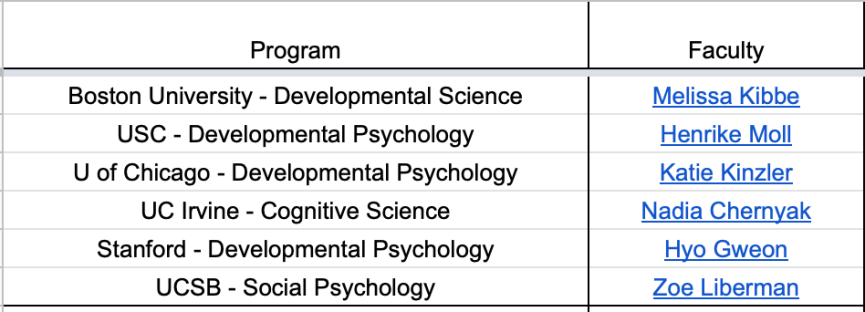
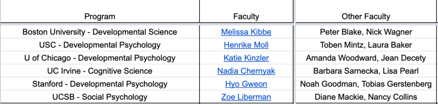
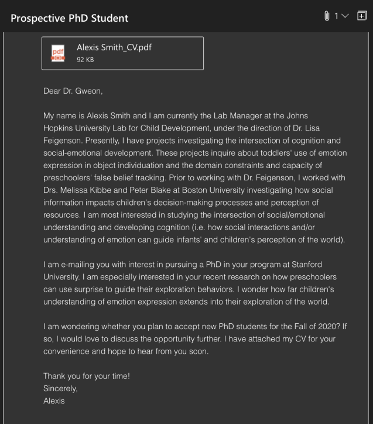

---
authors:
- admin
categories:
- gradschool
date: "2020-06-16T00:00:00Z"
draft: false
featured: false
image:
  caption:
  focal_point: ""
  placement: 2
  preview_only: false
# lastmod: "2020-12-13T00:00:00Z"
projects: []
subtitle: 
summary: 
tags:
- Graduate School
title: "applying to grad school on a budget and navigating the process: a saga"
slug: '2020/06/16/applying-to-grad-school-on-a-budget-and-navigating-the-process-a-saga/'
editor_options: 
  markdown: 
    wrap: sentence
---

## the problem with academia

A few weeks ago I was in this diversity Zoom meeting with other people in my department and a faculty member made a comment that there just are no diverse PhD applicants.
I was floored, because that statement was the farthest from the truth.
But if we entertained this idea, that in fact there are not a lot of diverse applicants, then we can think about why that might be.

One strong possibility is basic - a lack of proper mentorship for diverse high school and undergraduate students.
Students may not know about STEM opportunities because they come from first-gen or low-income households, like myself, and don't have anyone to seek guidance from in this process.
*Many students don't know that a PhD is a funded opportunity!*

A second possibility is that applicants are choosing to apply and attend programs where they feel represented.
Why would you choose to go somewhere where you feel ostracized for your race, ethnicity, sexual orientation, and/or financial status?
Very few people would do that willingly if there were other options.

A third alternative is that the cost of entering academia is too steep.
You have to pay to apply to college, graduate school, take standardized tests, send transcripts, and when you finally get to the interview stage you have to front the costs for travel.
This consideration combined with the first two possibilities is probably the most likely reason for the original statement.
There are structural and systemic barriers in place that make it difficult for certain types of applicants to enter academia.

While I could go on and on about these barriers, I would rather use this post as a resource to help increase the number of diverse PhD applicants and lower the financial burden of the application process.

What this post ***IS NOT*** is a guide on how to craft an application package!
What this post ***IS*** is a way for low income students to save money during the application process and learn more about the steps required in the process.
*Note that I only briefly cover interview funding, because I have yet to figure out a concrete way to deal with that particular burden.*

## budgeting

So, the first thing you should do is make a list of programs you want to apply to.
Just throw some programs and people down on a list, talk to your advisor about them.
Or maybe you don't have an advisor, talk to a professor in your desired field or a grad student/teaching assistant, I'm sure they'd be happy to direct you!
While my undergraduate and lab manager mentors were wonderful, most of my knowledge of navigating this process came from my lab's post-doc and graduate students!!
Having a list of programs will help you figure out your original budget.
Believe me, you will not apply to every school on that list or maybe any of the schools on the list, so don't stress too much the first time you draft one.
My list was rewritten many, many times.
Moving on...

An application fee on its own can range from \$50 to \$120.
It's expensive to apply to programs, similar to applying to undergrad.
**To minimize the overall cost, we want to do this strategically, so first we budget.** The use of "x" below refers to the number of programs you're applying to or the number of schools on your list.
Here are the typical components.

-   Application fee, the most common price I've seen is about \$100, so let's just say that's the cost of an application.
    \$100x.

-   GRE fees, \$205 + \$27 per score report, so that formula is \$205+ \$27x.
    If you have to take a subject test add \$150.

-   Transcripts, you'll probably need to send an official or unofficial transcript from your undergraduate university.
    It cost me \$8 per official electronic transcript, so let's say that's the norm.
    \$8x.

-   If you're an international student whose first language isn't English or your home institution was taught in another language, you will also need to factor in cost of the TOEFL or IELTS.
    Fees vary by testing location and sending scores is \$20 each.

Okay great, so now you have a formula that looks, more or less, like this:

> Application + GRE + Transcript = \$100x + \$205 + \$27x + \$8x = **\$135x + \$205**

**I applied to 7 programs so if we do that math, I should have spent \$1,150. BIG YIKES!!! But actually, I only ended up spending \$401.50 on applying to grad school. That's a savings of 65% ...if I did math right.** I would like to reiterate that this number does not include interview costs.
That's later down the line.

Okay, it's worth noting here that my original list had 6 programs, one got added in later in the process, so I budgeted for 6.
That means that before I began applying and really considering the programs on my list, my budget for applying was a little over \$1000 at \$1015 for 6 programs.
Now, if you get to this number and you know you can not afford it, do not fret.
It's just a budget number.
Clearly, I spent less than that.
If it really makes you uncomfortable, as money typically does, then reduce your number of programs temporarily.
If you plugged in 6 schools like me, but applying to 4 is really what you can feasibly do without losing sleep or sacrificing any basic needs (before any fee waivers or discounts), then just keep that number in your head when ranking programs.
Schools can always be added later, which I also did.

So now we have our budget.
The maximum number I can afford to spend (\$1015).
What now?

## applying strategically

Alright, let's work on that list of programs you made.
I'll just use my list, I'm sure the programs won't mind.
Here's a screen shot of my original 6 (Figure 1).

Where did I find these guys?!
Good question, that may be a little out of the scope of this post, but I can briefly talk about it.
Melissa was my undergraduate advisor and she is lovely.
She got me excited about research and guided me through my first round of applications during undergrad, which I no longer recommend personally, but others might tell you differently.
A different post for another time.
We talked about me applying to work with her again, so she went on my list.
Then the rest came from reading literature in what I'm interested in and monitoring the [CogDevListserv](https://cogdevsoc.org/listserv/), the [Psych Grad School Wiki](http://psychgradsearch.wikidot.com/), and even Twitter.
I think most fields have some sort of general Listserv where people post openings for jobs or PhD students, but this is what the Cog-Dev world uses.

Okay great, so I had my list.
Next step was taking a look at the program and other faculty in the program that fit my interest.
If I couldn't find at least two other faculty members who were of some interest to me, I removed them from my list.
Luckily, all 6 programs had two other people.
This was my second round of applications for graduate school, so I knew what to look for initially.
***Why is finding other faculty members important?*** Well, you want to apply to programs that will support you and make you a stronger researcher.
Certainly, the advisor you pick is the most important person, but having the option to actively collaborate with other faculty members is a very enticing factor.
Also, sometimes you get to graduate school and realize that the mentor you picked wasn't the best fit, but because you chose a program that had more faculty members of interest you have options!
Here's a screenshot of that additional list (Figure 2).

Okay, you can just apply now.
*JUST KIDDING, DO NOT DO THAT.* It would be a waste of your money to just blindly apply to your list.
First thing, if they did not explicitly post that they were looking for students somewhere (Listserv, Twitter, Wiki), you need to make sure they are.
Some faculty members don't have room in their lab, funding for another student, or just do not want to take another student.
This brings us to a very important section.

## the introduction email

For some reason, this is a highly debated topic, but I don't think so.
In August, I sent an email to everyone on my list, minus Melissa, either asking if they were taking a student or just introducing myself/offering to chat over Skype (ah, the pre-Zoom days).
It was brief and included my CV.
Here's a sample one (Figure 3).

My subject line was clear, addressed properly, and briefly told the person why I was writing them, what I was interested in, and finally, inquired whether they were planning to take a student or wanted to chat further.
I sent 5 e-mails, each curated to the person I was interested in, why I was interested in them, and a question I had pertaining to my own research.
If you can't do this easily, maybe spend more time with their papers or reconsider them on your list.
Some people will tell you that they sent these e-mails and got no responses, but I received 4 replies within 3 days, all encouraging me to apply to their programs or offering to meet at the Cog Dev Society conference that October/over Skype.
If you don't get a reply, it's up to you to decide if you want to apply to them anyway.
You can use your budget to make this decision for you if you're not sure.
I opted to apply to the person that didn't respond, just because the location of the program was optimal for my partner.
**The only time I don't recommend emailing is if the faculty member's website explicitly says not to send an email.** About a month later a new name crossed my path, Lindsey Powell at UCSD.
I'll come back to her in the applying to fee waivers section, but I sent Lindsey an email too and she responded later in the week.
Again, you can always add people!

## applying for fee waivers

Wonderful!
You have your final list of faculty members and programs!

### GRE Fee Waivers

Maybe let's back up one step and address the elephant in the room, the GRE.
An expensive necessity for programs.
Here's what I recommend.
**If you are a senior undergraduate student and your expected family contribution, according to your FAFSA, is lower than average, you receive financial aid, or you come from an economically disadvantaged household, talk to your financial aid office about a GRE fee waiver letter.** [Here's the link to the ETS GRE fee waiver form!](https://www.ets.org/gre/score-users/reducing-barriers/fee-reductions.html)
Now, maybe you're not ready to take the GRE and want to take a gap year and study, still apply for the voucher!
The voucher is good for a year and if you don't use it, that's okay because having the voucher makes you eligible to apply for another one the year after it expires (regardless of if you use or not)!
With the voucher, your GRE now costs \$102.50 and the subject test costs \$75.
Nice!

You can certainly take the GRE before you have an idea of where you might apply, but during the test you can send 4 score reports for free!
So that's a \$108 savings.
I highly recommend doing that!

The GRE voucher may also help you get a fee waiver for a program's application fee.
Stanford, for example, grants application fee waivers to students who receive GRE vouchers.
Other universities use GRE vouchers as extra evidence that a student has a financial hardship and can make the case you deserve an application fee waiver.

### Application Fee Waivers

Applying to fee waivers for departments is a little trickier.
Everyone wants something specific and different from somewhere else.
As an undergrad it's easier to prove that you're not financially dependent and your FAFSA Student Aid Report (SAR) does a lot of the talking for you.
Applying as a post-bac means you may need more paperwork or written statements, but it's worth it.
Of course, it does upset me that universities require explicit statements of need to grant fee waivers and then has to decide if one is "needy" enough, but that's a rant for another time.
If any part of the fee waiver application process is confusing call and email the graduate school admissions department, get them to explain it to you because it could be the difference of spending \$100 or more.
If they decline the waiver, you can also reach out to the admin officer of the department you're applying to and see if there are department fee waivers available to you.
Your faculty member of interest can't help you a lot in this portion of the process, but you could reach out to them and see if they have any advice or they could check for you.
Again, the power of reaching out beforehand is so, so beneficial.

After two weeks of emails and documentation, I received fee waivers from 5 of my 6 original schools.
If I was a current undergraduate student, I would have received all 6, but I wasn't in a position to complain.
Now let's come back to my newest addition, Lindsey Powell.
I applied to two other UC schools and received fee waivers, so I expected UCSD to be no different.
Then I got the fee waiver rejection email and that was a bummer because the UCSD application fee was \$120.
YIKES.
This is where my budget was helpful.
I used my excel sheet to track how much I spent, so I knew what I could afford.

My UChicago application fee was \$90, the GRE cost me \$102.50, the remaining score reports after my four free ones were \$54, and I only needed to send one official transcript so that was \$8.
I was at \$254.50, ***significantly*** under my budget.
I talked to my partner and we decided Lindsey and UCSD was a good fit for me academically and for us personally, so I bit the financial bullet and applied.
UCSD required GRE scores, but no official transcript right away, so the added amount was \$147.
**This made my total for applying to graduate school \$401.50.**

Is that a lot of money?
Absolutely, but it was strategically allocated to programs where I had already contacted potential advisors, was invited to apply, and would attend if admitted.
Being selective in your choices and doing research about the programs means that you're setting yourself up for success as much as you can.
It also was a fraction of my estimated budget!

## getting and navigating interviews

Okay...so I spent \$400, then what happened? 
Traditionally, two things can happen next starting in December after applications are due.

The first thing that can happen is that your potential PIs can invite you to an "informal" Skype or phone call after they review your application.
This is important for you too!
If you don't get a good vibe from the person during your chat, you should consider that as you move forward in your process.
I had informal chats with 4 of my 7 potential advisors.
Three happened before I even submitted an application, which was also helpful in making sure I was applying to people I would realistically want to work with.
Some advisors I chatted with twice (once before applying and once after), which was very nice, but not very common, in my experience.

### Conflicting Interview Invites

In January, I received 4 interview invites to on-campus interviews.
Here's where it gets expensive and also very tricky.
Grad schools have the unintentional habit of booking the same interview days as other schools.
You'll get mixed information on what to do about this, but I'll just tell you what I did.
Because I had done so much research on these programs and the people I chose, I knew that I would reasonably go to any one of these programs happily.
I didn't have a preference at this point.
Though, going back to Boston was particularly enticing for both my partner and I.
So I accepted interviews as they came in.
Other people will tell you to wait, and hold onto invites, in case your "top choice" conflicts with a lower ranked one.
If you've crafted your list well, you might be like me and have all your programs be equal at this point.

Of the four interviews, two overlapped with the other two.
The interview invite can come from the department or the PI.
When this happens, respond to whoever sent the email and explain that you have a conflict and see if there is an alternative interview day.
Typically, the answer is yes, but sometimes you'll get an ....interesting response.

For one program, the department emailed me and I responded requesting an alternative day.
They quickly replied and said that there was no alternative day and that was that.
Here's where having prior contact with the potential advisor can help you.
I emailed the potential advisor in that program and told them I was disappointed that there was no alternative day and that I had been looking forward to hearing about the program and seeing the campus in person.
I was actually very distraught about it, because I had spent so much time talking to this person, crafting my application package, and choosing this program.
**It felt very unreal that this program and person quickly became a rejection.**

*Luckily,* the advisor quickly emailed me back saying she would check with her department head and try to work something out.
I ended up going to an alternative day with one other applicant and it all worked out.
The moral of this particular situation is that you need to use all your resources and play all the cards in your hand, because no one's going to do it for you, okay?

Alright, so I had two formal on-campus interview days and two alternative days set up from the end of January to mid February.
This, in itself is tiring, especially if you don't have a job that lets you be flexible about travel for interviews.
In my head, applying to grad school is part of the lab manager job, but not everyone sees it that way.
My PI, Lisa Feigenson, was a very large supporter of mine in this process, so off I went to interviews and kept her the loop.
She often got an excited text from me before I boarded a plane pre- and post-interviews.
Having mentors that support you is so, so important in this process.
They've been there, and they'll remind you there's a light at the end of the tunnel.

### Paying for Interviews

Now the hardest part of interviews, other than the actual interviews, is fronting the money for them.
Some universities will pay out of their pocket for you to come to campus and interview.
This is one rare extreme.
On the other end of the spectrum, some universities won't pay for you to come at all, expecting you to pay for everything and house you with a student.
I don't recommend going to those.
For one thing, you need to know your worth in this process.
You are 100% worth more than no airfaire/room and board coverage.
Finally, you have the middle, expensive at first, and irritating option.
The university has told you they'll reimburse your expenses up to a certain amount.
And oh, by the way, the reimbursement could take up to 4+ months to receive.
*I love that.*

This is a *very* frustrating option and also a very difficult financial barrier.
It's upsetting that this is the norm for most universities.
Especially universities that encourage people from diverse and low-income backgrounds to apply.
***Do they think we just have hundreds of dollars lying around? What part of low-income did they not understand from the diversity statement they required you to write about overcoming your obstacles?*** It's unclear what their reasoning is for recruiting this population and not financially supporting them.

***Anyway***.
So what this option means is that you will pay out of pocket for your flight, and typically they'll cover your housing (either with a current grad student or at a hotel with another prospective).
If you find it extremely difficult to cover the cost of your travel to and from campus, I recommend contacting the department and CC'ing your potential advisor to see if they'll pay for your travel directly.
Some advisors will be amenable to paying for it with their own funding to be reimbursed later internally from the department.
It certainly doesn't hurt to ask, the worst they can say is that they can't do that.
In the event they can, then that's great.
No harm, no foul.

If they can't pay for you directly, you have a few options.
**One, pay for the travel out of pocket.** I had gotten a travel credit card for this specific purpose with a 0% APR for the first whatever months, because my programs were clear that reimbursement was the only option.
I earned miles on all my flights and cash back rewards without the fear of accruing interest on all these airfare purchases, so that was nice.
Whatever the card didn't cover, I paid for out of pocket.

**Option two, ask for a virtual interview day.** I don't particularly recommend this because being on campus and feeling the vibe of the department is what can make or break your experience.
Being around grad students during their mixer and sitting with faculty at lunch or dinner gives you an idea about the relationships within the department.
It's really important.
If you can't go to an interview day in-person and opt for a virtual one, make sure you get the chance to talk to graduate students in the department too!

Sometimes you'll get offers without going to any interview day, that's great!
It's rare now, but still happens.
Make sure you still talk to other faculty members and graduate students in the department.
See if they have an admitted students reception!
Committing to a PhD program is a big decision, so you want to make sure it's the right fit.

## deciding and negotiating

Lots of people, graduate students included, will tell you that you can't negotiate your offers.
That's...more or less true, but not entirely out of the question.
My personal view is that you literally have nothing to lose by asking!
In fact, faculty members ask for money all the time through grants, it's just a part of this life.
As my mother often reminded me throughout my childhood, "A quiet mouth, doesn't get fed."

Once you have one or two offers on the table, this is where current graduate students and your potential advisor come in.
During a few of my interview days grad students mentioned a number of internal funding opportunities and other perks of the department.
The school I selected had a program that would guarantee graduate housing for 6 years rather than the usual 2 years if your department nominated you for it.
This is especially important because off-campus housing near universities can have high rent, but graduate housing is usually subsidized.
When I received the acceptance letter from the PI, I asked if that program was an option for me, despite it not being included in my initial offer.
She quickly responded that she'd check with the department.
Later she let me know that I was being nominated for a fellowship that would include the housing program, but should I not receive it, we could explore different routes to the housing program.

Things like internal perks and fellowships can be negotiated to an extent.
My best advice is to talk to graduate students in the program and see what they've learned or would have done differently.
This is especially important when it comes to general funding.
Graduate students in another department I interviewed at told me they had to pay to attend conferences on their own, without reimbursement from the department or their PI, unless the PI was on a grant.

One selling point of a PhD program is that it's a paid position that ends with a degree.
You don't have to pay for it, your tuition is covered along with other needs, like health insurance.

-   When programs don't have funding for you to travel to present research, that's a red flag.

-   When programs won't pay for you to come to interview day, that's a red flag.

-   When graduate students tell you that they don't feel supported or they're worried about finances, that's a red flag.

Ultimately, I picked a spot with Lindsey Powell at UCSD for a number of reasons.
There are more than two other faculty members that fit well with my research interests and plenty of different avenues to explore.
I had fun during my interviews with the faculty.
It never felt like they were just grilling me about what I'd done or hope to do.
It was an open discussion.
The graduate students seemed happy and supported.
There were routes to extra funding.
And Lindsey seemed like the best fit, both academically and for the level of support I wanted from a PI.
She was the last one I added to my list, and the most expensive application, but was the right choice for me in the end.
Which hopefully illustrates that applying to grad school is a time to set expectations and plan, but to ultimately be flexible.
It's never too late to add a program to your list before the deadline.

There's not really a good place to end this post because there are so many financial things to consider when applying to grad school, but I hope this gave you somewhere to start!

## TL;DR

Applying to graduate school can be super expensive.
Going to interviews is also expensive.
For low-income students it can seem impossible and endlessly frustrating, but there are options to make this process more affordable.
There are fee waivers and alternatives for applicants who can't afford to pay out of pocket.
You'll still pay some money, but nowhere near what it could have been.
I'm not an expert and I can only talk about my experience and how I made it work for me, but maybe you fall into a similar category!
I hope this helps guide your process!
My Twitter DMs and inbox are always open if you have particular questions about what I did.

[Another perspective on fee waivers](https://twitter.com/bryandmartin_/status/1326980952719933440?s=21)
